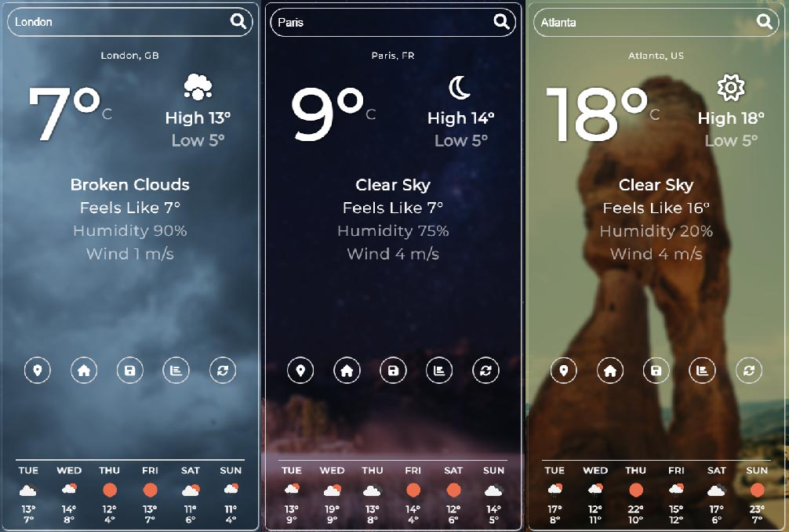

# Weather Forecast Application (HTML/CSS/JS)

This is a Weather App built while following a [Dave Gray](https://www.youtube.com/watch?v=s_Ie_yh_4Co) JavaScript tutorial.

## Table of contents

- [Overview](#overview)
  - [Functionality](#functions)
  - [Screenshot](#screenshot)
  - [Links](#links)
- [My process](#my-process)
  - [Built with](#built-with)
  - [What I learned](#what-i-learned)
  - [Continued development](#continued-development)
  - [Useful resources](#useful-resources)
- [Author](#author)
- [Acknowledgments](#acknowledgments)

## Overview

### The challenge

Users should be able to:

- Search via City / State / Country or Zipcode for weather forecast.
- Retrieve Weather at their current location.
- Retrieve Weather forecast for their specified "Home" location (saved in local storage) - if one has been specified.
- Save / Set their "Home" location view the application.
- Change their preferred "Units of measurement" (imperial/metric).
- Refresh the Weather forecast data.

### Screenshot

### Links

- Solution URL: [gitHub](https://github.com/Drakan21/WeatherApp)
<<<<<<< HEAD
- Live Site URL: [netlify](https://roostweatherapp.netlify.app/)
=======
- Live Site URL: [Weather APP On Netlify](https://roostweatherapp.netlify.app/)
>>>>>>> c237a76a0aa7904f2f1b788057dafcaaed2b37bf

## My process

### Built with

- Semantic HTML5 markup
- SCSS / Sass
- CSS Flexbox / Grid
- Mobile-first workflow
- Javascript

### What I learned

- How to separate SCSS files into smaller units for easier workflow.

### Continued development

• Continue refinement of project JS to improve safety and stability of application.
• Implement more granularity for weather conditions reflected within the application.

### Useful resources

Tutorial by:

- [Dave Gray](https://www.youtube.com/channel/UCY38RvRIxYODO4penyxUwTg) - Very well thought out tutorials and introductions to web development topics.

Some helpful documentation:

- [Mozilla MDN](https://developer.mozilla.org/en-US/docs) - This helped me for XYZ reason. I really liked this pattern and will use it going forward.
- [W3Schools](https://w3schools.com) - Basic W3 resource

Other Resources:

- [cdnj Font Awesome](https://cdnjs.com/libraries/font-awesome) - Icons, etc.
- [Google Fonts](https://fonts.google.com) - Fonts
- [Unsplash](https://unsplash.com/) - Background images
- [Icons8](https://icons8.com/) - Cool(free) Icons

## Author

- Twitter - [@drakanion](https://www.twitter.com/drakanion)

## Acknowledgments

Thanks to Dave Gray for his very verbose tutorials and guides on web development, they are incredibly useful for understanding the finer points of complex interactions within these technologies.
